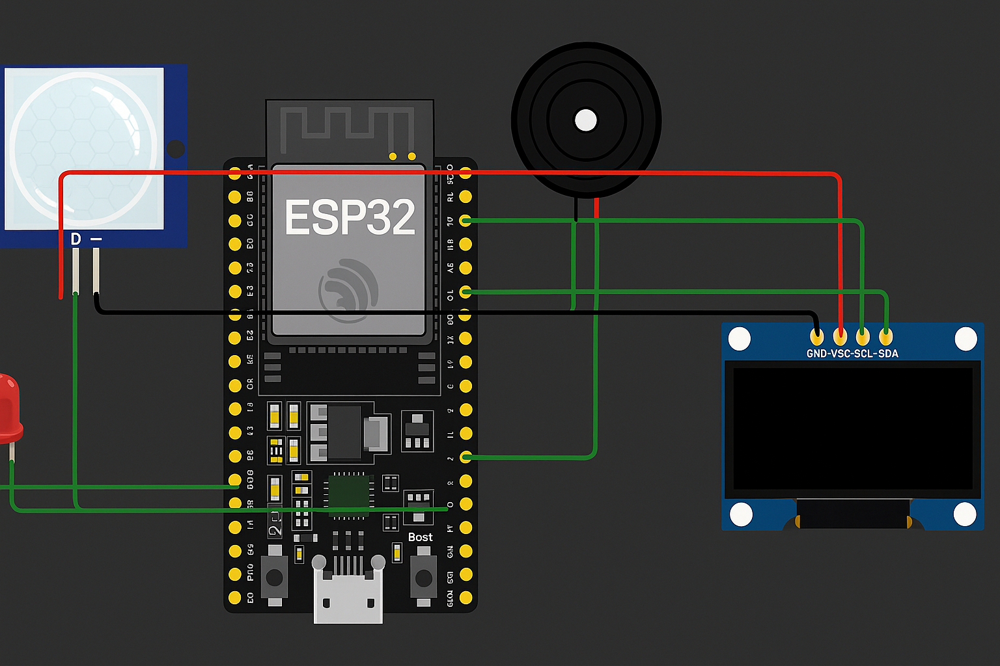

# Smart Motion Sentinel 1.0 

An IoT-based motion detection system built using ESP32, PIR sensor, OLED, LED, and Buzzer.

# Video with explanation 

---

##  Features
- Real-time motion detection
- OLED display for live status and event count
- Buzzer and LED alerts
- Serial monitor logging
- Designed during India Space Lab Summer Internship 2025

---

## 🛠️ Hardware Used
- ESP32 DevKit v4
- PIR Sensor
- OLED Display (SSD1306)
- Active Buzzer
- Red LED

---

##  Output
Displays motion detection count and area status on OLED.

---

##  Project Images

### India Space Lab Logo

### ESP32 Microcontroller Circuit

---

##  Report
The full LaTeX project report is inside the [`report`](ISL_Report_S.pdf) folder.
